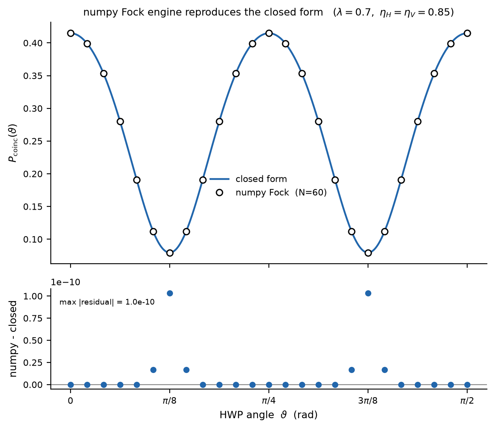

# Numerical benchmark — NumPy from scratch

The [derivation](../theory/cc_derivation.md) produces a *closed form* for the joint
no-click probability of the half-wave-plate-rotated TMSV measured by two lossy bucket
detectors. A closed form is only as trustworthy as the independent check behind it.
This page builds that check **from scratch in NumPy**: it constructs the quantum state
in a truncated Fock space, applies the lossy-detector model directly, and compares the
result to the analytic expression at every wave-plate angle.

Nothing here depends on a specialised quantum library — only `numpy`. The
[companion QuTiP page](numerical_benchmark_qutip.md) does the same thing with a
purpose-built quantum-optics toolkit; the two agree, which is the point.

!!! note "What is being validated"
    Two independent routes to the same number:

    - **Closed form** — the analytic result derived on the site,
      $P^{(\eta_H,\eta_V)}(0,0)=\dfrac{1-\lambda^2}{\sqrt{(1-\lambda^2 t_H t_V)^2-\lambda^2(\eta_H-\eta_V)^2\sin^2 4\vartheta}}$,
      with $t_{H,V}=1-\eta_{H,V}$, combined by inclusion–exclusion.
    - **Fock-space simulation** — build
      $|\Psi\rangle=\sqrt{1-\lambda^2}\,e^{\lambda K^\dagger}|0,0\rangle$ explicitly on a
      photon-number grid and evaluate the detector POVM numerically.

    If the two agree to the Fock-truncation floor across all $\vartheta$, the closed form
    is confirmed.

## 1 — The closed form

`closed_P00` returns the probability that **neither** detector clicks. The half-wave plate
enters only through $\sin^2 4\vartheta$, so the curve is $\pi/2$-periodic and symmetric
about $\vartheta=\pi/4$. `closed_Pcoinc` turns that no-click quantity into a
**coincidence** probability by inclusion–exclusion,

$$P_{\mathrm{coinc}} = 1 - P_H(\text{no click}) - P_V(\text{no click}) + P(0,0),$$

where each single-arm no-click probability is $P(0,0)$ evaluated with the *opposite*
detector made transparent ($\eta=0$, so it can never click).

```python
import numpy as np

def closed_P00(lam, etaH, etaV, theta):
    """Joint no-click probability P^{(eta_H,eta_V)}(0,0)."""
    tH, tV = 1.0 - etaH, 1.0 - etaV
    num = 1.0 - lam**2
    den = np.sqrt((1.0 - lam**2 * tH * tV)**2
                  - lam**2 * (etaH - etaV)**2 * np.sin(4.0 * theta)**2)
    return num / den

def closed_Pcoinc(lam, etaH, etaV, theta):
    """P_coinc = 1 - P_H(no click) - P_V(no click) + P(0,0)."""
    P00 = closed_P00(lam, etaH, etaV, theta)
    PH0 = closed_P00(lam, etaH, 0.0, theta)   # only H can click
    PV0 = closed_P00(lam, 0.0, etaV, theta)   # only V can click
    return 1.0 - PH0 - PV0 + P00
```

## 2 — The Fock-space simulation

The state is $|\Psi\rangle=\sqrt{1-\lambda^2}\,e^{\lambda K^\dagger}|0,0\rangle$ with the
HWP-rotated pair-creation generator

$$K^\dagger=(\cos 2\vartheta\,a_H^\dagger+\sin 2\vartheta\,a_V^\dagger)
(\sin 2\vartheta\,a_H^\dagger-\cos 2\vartheta\,a_V^\dagger).$$

We represent the two-mode state as an $N\times N$ NumPy array indexed by photon numbers
$(n_H,n_V)$. Two ideas keep it exact and fast:

1. **Creation operators act by array shifting.** $a^\dagger$ maps
   $|n\rangle\mapsto\sqrt{n+1}\,|n+1\rangle$, i.e. a shift-by-one along the relevant axis
   with a $\sqrt{n}$ weight — no dense matrix is ever formed.
2. **The exponential is summed as a power series applied to the state**,
   $|\Psi\rangle=\sum_n\frac{\lambda^n}{n!}(K^\dagger)^n|0,0\rangle$. Each term is the
   previous one hit once more with $K^\dagger$, so the whole state costs a handful of
   array shifts per order.

A bucket detector that sees $n$ photons stays dark with probability $(1-\eta)^n$, so the
both-dark probability is the photon-number distribution $|\langle n_H,n_V|\Psi\rangle|^2$
contracted against the diagonal weight $t_H^{\,n_H}t_V^{\,n_V}$.

```python
def brute_P00(lam, etaH, etaV, theta, N=60, nmax=45):
    """P(0,0) from the explicit HWP-rotated TMSV in an N-per-mode Fock box."""
    c, s = np.cos(2*theta), np.sin(2*theta)
    Lam = np.sqrt(1.0 - lam**2)

    def adag(psi, mode):                     # creation op = shift + sqrt(n) weight
        out = np.zeros_like(psi)
        rng = np.sqrt(np.arange(1, N))
        if mode == 'H':
            out[1:, :] += rng[:, None] * psi[:-1, :]
        else:
            out[:, 1:] += rng[None, :] * psi[:, :-1]
        return out

    def Kdag(psi):
        t1 = s*adag(psi, 'H') - c*adag(psi, 'V')
        return c*adag(t1, 'H') + s*adag(t1, 'V')

    psi = np.zeros((N, N)); psi[0, 0] = 1.0
    acc = np.zeros((N, N)); term = psi.copy()
    for n in range(nmax):                    # exp(lam K^dag) as a power series
        acc += term
        term = Kdag(term) * (lam / (n + 1))
    psi = Lam * acc

    i = np.arange(N)[:, None]; j = np.arange(N)[None, :]
    w = (1 - etaH)**i * (1 - etaV)**j        # t_H^{n_H} t_V^{n_V}
    return float(np.sum(np.abs(psi)**2 * w))

def brute_Pcoinc(lam, etaH, etaV, theta, N=60, nmax=45):
    P00 = brute_P00(lam, etaH, etaV, theta, N, nmax)
    PH0 = brute_P00(lam, etaH, 0.0, theta, N, nmax)
    PV0 = brute_P00(lam, 0.0, etaV, theta, N, nmax)
    return 1.0 - PH0 - PV0 + P00
```

## 3 — Parameters

We pick a deliberately demanding regime. At $\lambda=0.7$ the mean pair number per mode is
$\bar n=\lambda^2/(1-\lambda^2)\approx 0.96$ — nearly one pair per mode — so multi-pair
terms are large and the Fock truncation is genuinely stressed. Symmetric efficiencies
$\eta_H=\eta_V=0.85$ switch off the $\sin^2 4\vartheta$ term, leaving the baseline curve.

```python
lam = 0.7             # squeezing parameter  (n_bar ~ 0.96 pairs/mode)
etaH = etaV = 0.85    # detector efficiencies
N, nmax = 60, 45      # Fock-box size per mode, power-series terms

th = np.linspace(0, np.pi/2, 400)
curve = np.array([closed_Pcoinc(lam, etaH, etaV, t) for t in th])

th_pts = np.linspace(0, np.pi/2, 25)
Pq  = np.array([brute_Pcoinc(lam, etaH, etaV, t, N, nmax) for t in th_pts])
Pc  = np.array([closed_Pcoinc(lam, etaH, etaV, t)         for t in th_pts])
resid = Pq - Pc
print(f"max |residual| = {np.max(np.abs(resid)):.2e}")
```

## 4 — Result



The open markers sit on the closed-form curve everywhere, and the residual panel shows the
difference is at the **$10^{-10}$ level** — set entirely by Fock truncation at $N=60$, not
by any modelling difference. Two independent constructions — an analytic no-click formula
and a direct Fock-space simulation with a bucket-detector POVM — agree to machine-limited
precision across the full wave-plate scan, so the closed form is validated.

The residual is largest near $\vartheta=\pi/8$ and $3\pi/8$, where the coincidence signal
peaks and the state carries the most high-photon-number weight — exactly where a finite
Fock box is most strained. Increasing $N$ pushes the floor down further.

!!! tip "Reproduce it"
    The functions above are the complete engine — copy them into a cell and run. The same
    code, packaged with a self-test, lives in `spdc_coincidence.py` in the repository.
