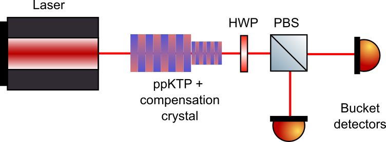

# Experimental setup

The experimental configuration considered in the following calculation consists of a pumped type-II ppKTP crystal producing degenerate photons, followed by a compensation crystal to correct temporal walkoff between the horizontal and vertical components. The generated state is then rotated by a HWP at angle 
$\vartheta$, spatially separated at a polarizing beam splitter (PBS), and finally measured by bucket detectors. 

  
  

    SPDC setup with HWP and PBS followed by bucket detectors
  

  <a class="nav-next" href="simplified_example.md">
    Next
    →
  </a>

